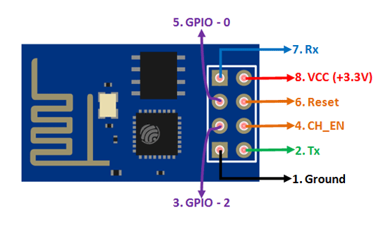

# ESP8266
ESP8266 bruger ikke en AVR processor, så det er ikke muligt at flashe et program til den ved at bruge Atmel Studio.

Jeg har brugt Arduino IDE og en YP-05 Seriel adapter til formålet. Det er også muligt at bruge en anden arduino til at forbinde med ESP8266 og flashe den via. Arduinoen. Se diagrammet nederst. På trods af at diagrammet bruger en Arduino Nano er princippet det samme.

Dette har dog vist sig at være en upålidelig måde at flashe modulet på, da det ikke er altid der kan oprettes forbindelse i Arduino IDE.



| Pin Number 	| Pin Name 	| Alternate Name 	| Normally used for                                              	| Alternate purpose                                                 	|
|------------	|----------	|----------------	|----------------------------------------------------------------	|-------------------------------------------------------------------	|
| 1          	| Ground   	|                	| Connected to the ground of the circuit                         	|                                                                   	|
| 2          	| TX       	| GPIO - 1       	| Connected to the Rx pin of the programmer/uC to upload program 	| Can act as general purpose I/O pin when not used as TX            	|
| 3          	| GPIO - 2 	|                	| General purpose I/O pin                                        	|                                                                   	|
| 4          	| CH_EN    	|                	| Chip Enable - Active high                                      	|                                                                   	|
| 5          	| GPIO - 0 	| Flash          	| General purpose I/O pin                                        	| Takes module into serial programming when held low during startup 	|
| 6          	| Reset    	|                	| Resets the module                                              	|                                                                   	|
| 7          	| RX       	| GPIO - 3       	| Connected to the Tx pin of the programmer/uC to upload program 	| Can act as general purpose I/O pin when not used as RX            	|
| 8          	| Vcc      	|                	| Connect to +3.3V only                                          	|                                                                   	|

[Source](https://components101.com/wireless/esp8266-pinout-configuration-features-datasheet)

## Programmering af ESP8266

[Source](https://vlahavas.com/posts/20190703-program-esp8266-with-arduino-nano/)

### Alternative diagram


# Source code (Arduino)
```c
#include <DHT.h>
#include <DHT_U.h>
#include <ESP8266WiFi.h>
#include <WifiClient.h>

#define DHTPIN 2 // GPIO - 1 on ESP8266

const char* ssid     = "";
const char* password = "";
const char* host = "";
uint16_t port = 5000;

DHT dht(DHTPIN, DHT11);

void setup() {
  Serial.begin(115200);
  dht.begin();

  WiFi.begin(ssid, password);
  
  while (WiFi.status() != WL_CONNECTED) {
    delay(500);
  }
}

void loop()
{
  delay(2000);

  float temp = dht.readTemperature();
  float humi = dht.readHumidity();
  for (uint8_t i = 0; i < 2; i++)
  {
    delay(1000);
    String sensor;
    float value;
    if (i == 0)
    {
      sensor = "dht2-temp";
      value = temp;
    }
    else
    {
      sensor = "dht2-hum";
      value = humi;
    }
    String url = "/readings/add?sensor=" + sensor + "&value=" + value;  
  
    WiFiClient client;
    if (client.connect(host, port)) {
      client.print(String("GET ") + url + " HTTP/1.1\r\n" +
                  "Host: " + host + ":" + port + "\r\n" + 
                  "Connection: keep-alive\r\n\r\n");
    }
    client.stop();
  }
}
```